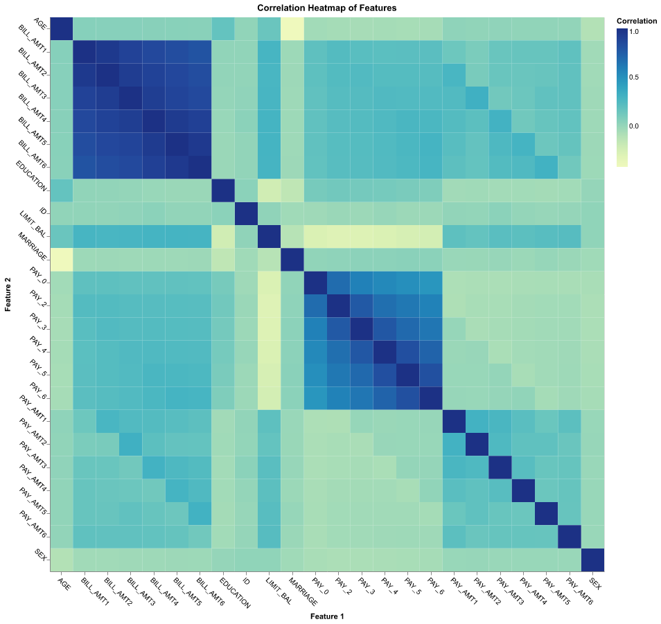

# Credit Card Default Prediction — Exploratory Data Analysis (EDA) Summary

Welcome to the EDA summary for the Credit Card Default Prediction project. This document walks through the key steps and findings from analyzing the dataset, with visual aids included for clarity.

---

## Introduction

We explore a classification problem: predicting whether a client will default on their credit card payment next month. The dataset contains 24 features including demographics (age, education, marital status), credit limits, and financial history (payment status, bill amounts, payment amounts). Our goal is to understand the data, identify important features, handle challenges like class imbalance, and prepare for building predictive models.

---

## Dataset Overview

The dataset consists of 25 columns, including:

- **ID**: Unique client identifier (dropped for analysis)  
- **Demographic Features**: SEX, EDUCATION, MARRIAGE, AGE  
- **Credit Information**: LIMIT_BAL (credit limit)  
- **Payment History**: PAY_0 to PAY_6 (status over 6 months)  
- **Bill Amounts**: BILL_AMT1 to BILL_AMT6 (bills over 6 months)  
- **Payment Amounts**: PAY_AMT1 to PAY_AMT6 (payments over 6 months)  
- **Target**: `payment_status_next_month` (0 = no default, 1 = default)

---

## Numerical Summary

  
*Summary statistics show wide variability in credit limits and bill amounts. Payment statuses tend to be slightly negative, indicating most clients pay on time.*

---

## Distribution and Outlier Analysis

### Histograms and Boxplots of Key Features

  
- **LIMIT_BAL and AGE** show right-skewed distributions with some outliers.  
- **Bill amounts (BILL_AMT1-6)** are mostly low but have occasional high outliers, indicating some clients max out their credit.  
- **Payment amounts (PAY_AMT1-6)** cluster near zero with some large outliers, reflecting partial payments.  
- Log transformation or scaling is recommended before modeling.

---

## Target Variable Distribution

  
- The dataset is imbalanced: ~78% non-default, ~22% default.  
- This imbalance requires careful model evaluation using metrics beyond accuracy (e.g., precision, recall, F1-score, ROC-AUC).

---

## Correlation Analysis

  
- Strong correlations exist among payment statuses and among bill amounts across months, indicating consistent payment behavior and spending patterns.  
- Moderate correlation between credit limits and bill amounts.  
- Demographic variables show weak correlations with financial behaviors.

---

## Multicollinearity Insights

- High correlation between some payment months (e.g., PAY_2 & PAY_3 at 0.77) suggests overlapping information, which can affect model stability.  
- Slight negative correlation between AGE and MARRIAGE (-0.41) indicates younger clients tend to be unmarried.  
- Awareness of multicollinearity helps in feature selection or using robust modeling methods.

---

